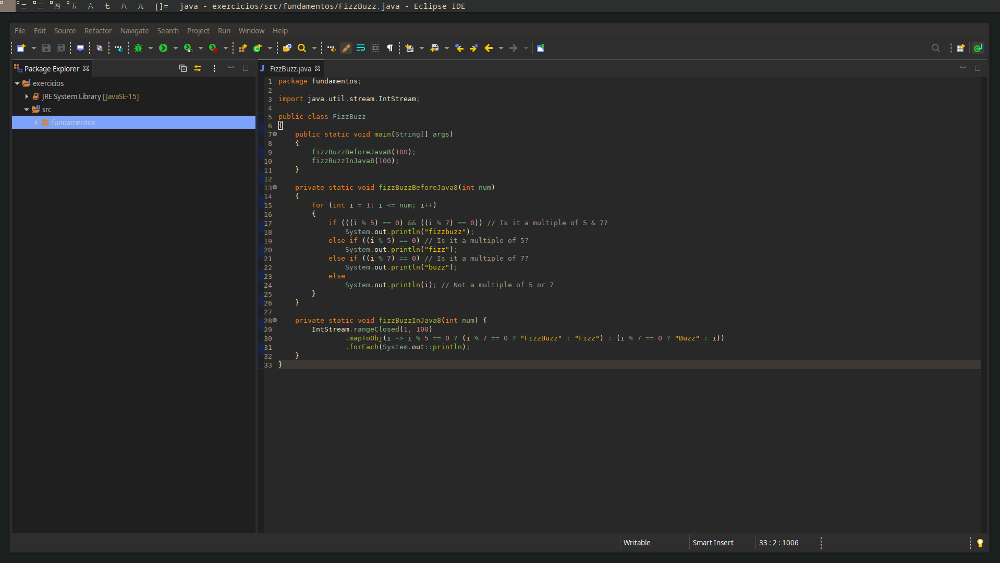

# Gruvbox Dark Custom

## Description 
 
This is a implementation of my preferred color theme, gruvbox, for the Eclipse IDE. 

This particular implementation is focused on the Java perspective of said IDE.

## Dependencies

Before installing this theme, one must install the DevStyle package from the Eclipse Marketplace.

## Installation

You must simply download the XML file, import it on:

1. Window

2. Preferences 

3. DevStyle 

4. Editor theme 

I also recommend setting the workbench theme to Dark Custom and the HSL to (0,0,16)

You can also find the XML file [here](http://www.eclipsecolorthemes.org/?view=theme&id=62229)

## Screenshot

.

